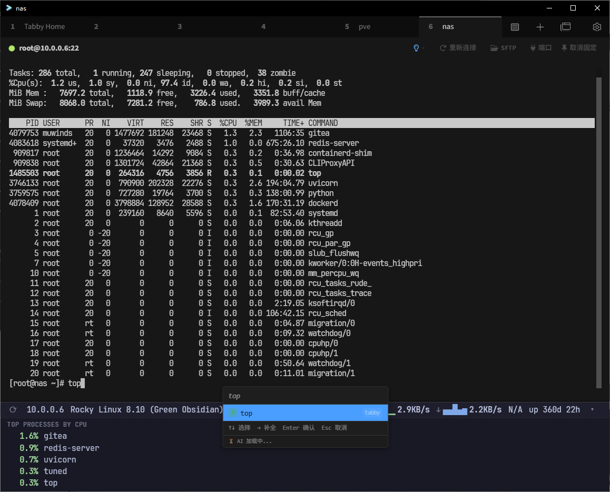

# tabby-server-status

一个 [Tabby](https://tabby.sh/) 插件 —— 在 SSH 标签页的顶部以紧凑状态栏的形式
持续显示远端服务器的关键运行指标：

- **IP** 服务器出口 / 本机地址
- **CPU** 使用率（百分比）
- **MEM** 使用率（百分比）
- **网络上传 / 下载** 即时速率（B/s）
- **操作系统** 发行版与版本
- **时区**
- **运行时间**（uptime）
- **Top 进程** —— 默认折叠，点开后看 CPU 占用前 5

每 5 秒采集一次，自动跟随 SSH 会话开闭。**不需要在服务器端安装任何东西**，
所有指标通过执行标准 shell 命令（`/proc`、`ip`、`top`、`ps`、`netstat`…）采集。

## 预览



## 兼容性

| 平台 | 支持度 |
| --- | --- |
| Linux (glibc/musl) | ✅ 完全支持，使用 `/proc` |
| macOS | ✅ 通过 `sw_vers` / `vm_stat` / `top -l 1` |
| FreeBSD / OpenBSD | ✅ 通过 `sysctl` / `netstat -ib` |
| Windows (OpenSSH) | ❌ 不支持（脚本依赖 POSIX shell） |

## 安装

### 从源码构建

```sh
npm install --legacy-peer-deps
npm run build
```

构建产物在 `dist/`。

把整个目录拷贝到 Tabby 的插件目录：

- **Windows**：`%APPDATA%/tabby/plugins/node_modules/tabby-server-status/`
- **macOS**：`~/Library/Application Support/tabby/plugins/node_modules/tabby-server-status/`
- **Linux**：`~/.config/tabby/plugins/node_modules/tabby-server-status/`

注意 Tabby 通过 `node_modules` 加载插件，目录结构必须是
`<plugins>/node_modules/tabby-server-status/{package.json,dist/...}`。

重启 Tabby 即可生效。

### 通过 Tabby 插件市场

发布后可在「设置 → 插件」中搜索 `server-status` 安装（暂未发布）。

## 测试

纯函数（解析器 + 格式化）有单元测试：

```sh
npx tsc -p tsconfig.test.json
node tests-build/tests/run.js
```

预期输出 `All tests passed.`（共 37 项）。

## 实现说明

- **数据采集**：`src/probe.ts` 是一个跨平台 POSIX shell 脚本，把所有指标用
  `===KEY===` 分隔输出到一次 `requestExec()` 的 stdout。
- **解析**：`src/parser.ts` 纯函数，按分隔符切片，缺失字段降级为 `N/A` / `null`。
- **网络速率**：保存上次累计字节数，下次采样时除以时间差。计数器回绕（重启）时夹紧到 0。
- **CPU 采样**：Linux 上 `/proc/stat` 两次采样取差（脚本里 `sleep 1`，所以每次采集
  耗时约 1 秒）。macOS/BSD 走 `top -l 1` / `top -bn1` 的瞬时值。
- **UI 注入**：`src/statusBarInjector.service.ts` 监听 `AppService.activeTabChange$`，
  在每个 `SSHTabComponent` 的 host DOM 顶部 prepend 一个动态创建的组件。

## 已知限制

- 第一次采样时网络速率显示 `—`（需要两次采样才能算速率）。
- Linux CPU 采样会让每次采集额外耗时约 1 秒（因 `/proc/stat` 双采样间的 `sleep 1`）；
  可接受，不阻塞 UI（异步执行）。
- 同时打开多个 SSH 标签页时，状态栏挂载位置依赖"活动标签页是当前选中"这一假设。
  非活动 tab 切换到活动时才挂载，这是 Tabby 没有公开"tab DOM 就绪"事件的折衷。

## 许可

MIT
